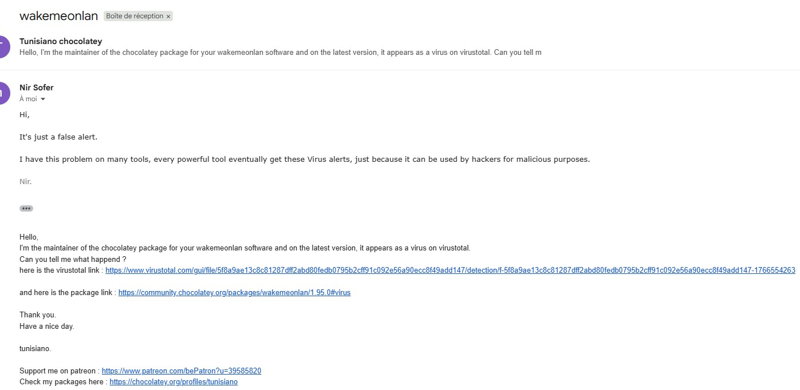

 

## Wake Me On LAN
This utility allows you to easily turn on one or more computers remotely by sending 
Wake-on-LAN (WOL) packet to the remote computers.

When your computers are turned on,  WakeMeOnLan allows you to scan your network, and 
collect the MAC addresses of all your computers, and save the computers list into a file.

Later, when your computers are turned off or in standby mode, you can use the stored 
computers list to easily choose the computer you want to turn on, and then turn on all 
these computers with a single click.

WakeMeOnLan also allows you to turn on a computer from command-line, by specifying the 
computer name, IP address, or the MAC address of the remote network card.

Virus alert

### 

### Package-specific issue
If this package isn't up-to-date for some days, [Create an issue](https://github.com/tunisiano187/Chocolatey-packages/issues/new/choose)

Support the package maintainer and 
